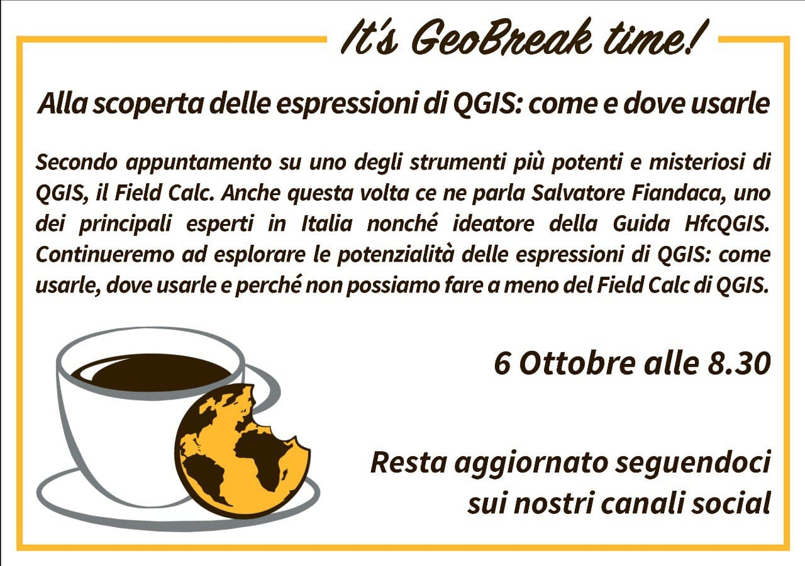
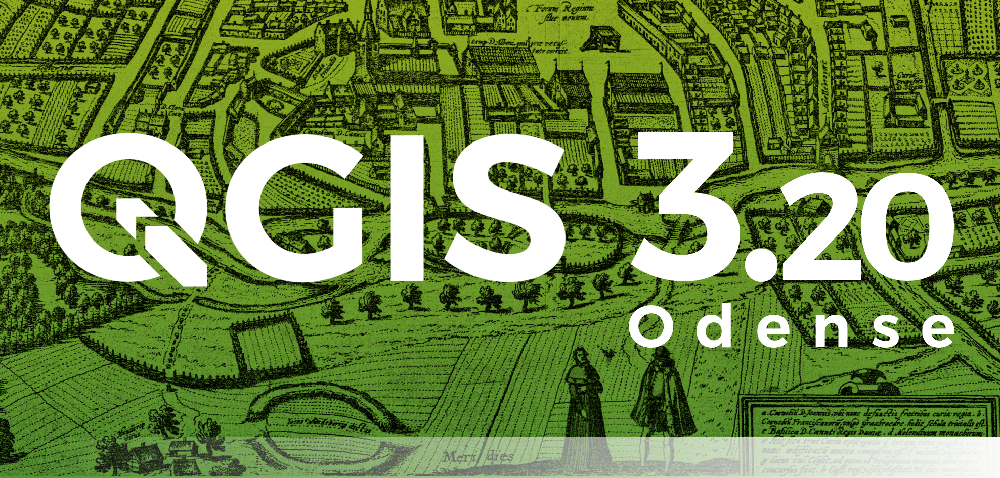
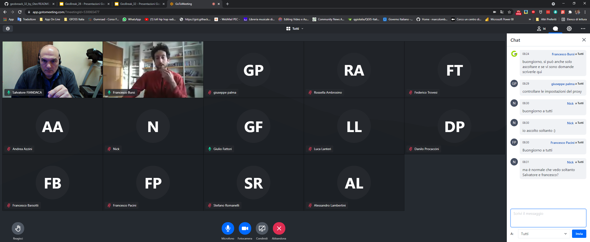
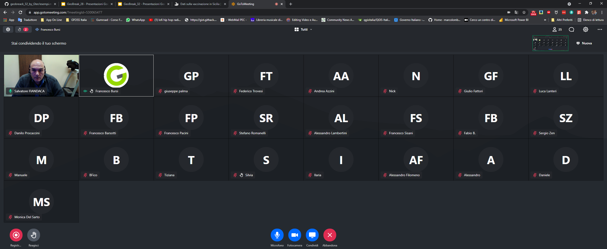

# GeoBreack 32 by Gter

GeoBreak 32 - alla scoperta delle espressioni di QGIS - secondo appuntamento

---

**INDICE**

<!-- TOC -->

- [GeoBreack 32 by Gter](#geobreack-32-by-gter)
  - [Relatore](#relatore)
  - [Data, luogo e durata](#data-luogo-e-durata)
  - [Piattaforme e Software](#piattaforme-e-software)
- [Programma secondo appuntamento](#programma-secondo-appuntamento)
  - [esempi pratici](#esempi-pratici)
  - [QGIS e le espressioni ESEMPI](#qgis-e-le-espressioni-esempi)
- [Contatti](#contatti)
  - [Salvatore Fiandaca](#salvatore-fiandaca)
  - [Sitografia](#sitografia)
- [Riferimenti utili](#riferimenti-utili)
- [Cosa c'è in questo repo](#cosa-cè-in-questo-repo)
  - [risultati](#risultati)

<!-- /TOC -->

---

**TITOLO**:   Alla scoperta delle espressioni di [QGIS](https://qgis.org/it/site/): come e dove usarle.

**DESCRIZIONE**:   Obiettivo di questo GeoBreak è quello di evidenziare le potenzialità delle espressioni di **QGIS**: come usarle, dove usarle e perché non possiamo fare a meno del Field Calc di QGIS.

---

## Relatore

- **Totò FIANDACA** (aka pigreco)  (Membro [OpenDataSicilia](http://opendatasicilia.it/) (2014) | Membro [QGIS Italia](http://qgis.it/) (2015) | Socio [GFOSS.it](https://gfoss.it/) (2017) | Membro [QGIS organization](https://github.com/qgis) (2020) | Ideatore della Guida [#HfcQGIS](http://hfcqgis.opendatasicilia.it/it/latest/) (2018))

## Data, luogo e durata

- 🗓 06/10/2021 con orario  🕟 08.30 🕢 09.30 
- 🌐 on-line
- ⏳ una ora

## Piattaforme e Software

- [gotomeet](https://www.gotomeet.me/GTER1/geobreak) - per diretta web
- Windows 10 64b - come SO
- [`QGIS 3.20 Odense`](https://qgis.org/it/site/)

# Programma secondo appuntamento

## esempi pratici

1. come posso utilizzare le espressioni:
   1. semplici funzioni;
   2. semplici espressioni;
   3. complesse espressioni;
   4. richiamare altri layer;
   5. creare nuovi campi;
   6. aggiornare campi esistenti;
   7. creare campi virtuali;
2. primi esempi:
   1. semplice calcolatrice;
   2. funzioni semplici $area, $perimeter
   3. generatore di geometrie (stile e label);
   4. generare geometrie tramite espressioni (processing)
3. esempi 
   1. aggregazioni;
   2. overlay_*;
   3. array;
   4. maps.

[↑ torna su ↑](#geobreack-32-by-gter)

## QGIS e le espressioni ESEMPI

Le espressioni di QGIS permettono di velocizzare il lavoro in QGIS

- [slide primo incontro 23/06/2021](https://docs.google.com/presentation/d/e/2PACX-1vQb1Ob4fa-lROXPBHDqAmyvmfH_ftnJKvQ22XC5SXjQC7TO7jTZE2L4LgJtznBdeGkgamVeqkbkhpeE/pub?start=false&loop=false&delayms=3000)
- [slide secondo incontro 06/10/2021](https://docs.google.com/presentation/d/e/2PACX-1vSD8QurjzQZFRbXJgeaJd5nzILLfPfoIQUClyz4Fy_ajAQgkiZfIKiFQDOo7If4R_6be_G18NDKlHOY/pub?start=true&loop=false&delayms=3000)
- **video youtube primo incontro 23-06-2021** : <https://youtu.be/tHrJNs3njrM>
- **video youtube secondo incontro 06-10-2021** : <https://youtu.be/MDwCdXHwdJg>

[↑ torna su ↑](#geobreack-32-by-gter)

# Contatti

## Salvatore Fiandaca

* **Mail**: <pigrecoinfinito@gmail.com>
* **Facebook**: <https://www.facebook.com/pigreco314>
* **Twitter**: <https://twitter.com/totofiandaca>

## Sitografia

* **blog**: <https://pigrecoinfinito.com/>
* **canale youtube**: <http://www.youtube.com/c/TotòFiandaca>
* **HfcQGIS**: <https://hfcqgis.opendatasicilia.it/>
* **Tansignari**: <http://tansignari.opendatasicilia.it/it/latest/#>
* **data.world**: <https://data.world/pigrecoinfinito>
* **github**: <https://github.com/pigreco>
* **gitlab**: <https://gitlab.com/pigr3co>
* **Canale Telegram** : <https://t.me/pigrecoinfinito>

[↑ torna su ↑](#geobreack-32-by-gter)

# Riferimenti utili

- **Gter srl** : <https://www.gter.it/>
- **QGIS** : <https://qgis.org/it/site/>
- **Repo QGIS** : <https://github.com/qgis/QGIS/blob/master/README.md>
- **Font Trueno** : <https://www.wfonts.com/font/trueno>
- **Visual Style Guide** : <https://www.qgis.org/en/site/getinvolved/styleguide.html#trueno-fonts>
- **Visual Studio Code** : <https://code.visualstudio.com/>
- **OpenDataSicilia** : <http://opendatasicilia.it/>

[↑ torna su ↑](#geobreack-32-by-gter)

# Cosa c'è in questo repo

- cartella `imgs` contiene le immagini utilizzate nel progetto .qgs;
- cartella `risorse` contiene i file utilizzati nel progetto, come:
- file `license` è il file che definisce la licenza del repository;
- file `README.md` è questo file, con le info.

[↑ torna su ↑](#geobreack-32-by-gter)

## risultati

- presente: 25

